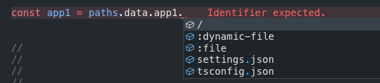
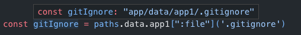
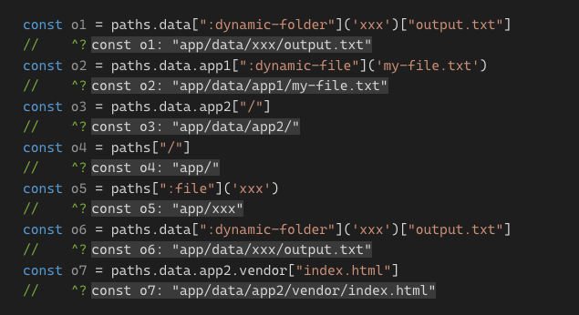

# typed-fs-paths

Library for type-safeness access to your file system paths under `1KB` (~`600B` minified)

[interactive Typescript preview](https://www.typescriptlang.org/play?#code/PQKgBApgzgNglgOwC4FoAmcoEMBGMJgACSAngA7QDGATnGatPMsAgPYoCuCHUEaKANyzUoYEMABQE0CAliwpCvwBmcfCigkoSCAFsUZLEgAWUOeKnBgYFLZQLRHJGtF2UExQQASELGgA8ACoAfGAAvGCBkAAeOghoogDaiMoQ1GAAYnAiSACSOroANGAAdGUpaWAA+gBK0EgAumAA-JnZ2vl6YABcYAgQAmke5ASBWGpBoRFRELEQ8UkV6VVZOZ1FpeUIqel12k2te0g9fQNDnm05ADIQSDrUk+GRMXEJYAAGACQA3kuZAL4-P7Uer-d4tTInfqDajDChgADCWG0QWKAFUps9Zq9RGiIVFemipBcAFKsRBBF7zN7aWgIADmiQaxQAIhB4Lo4PcqQswLTEPTMTM5rzkttKhkGnIIRlpb0rEQkFAULMKJQGNRqKxYWBdR8fj4-JNAd82RyuWkTWSKWMJiFWey4Jz7sEwcSRmAAHJwSgQACyaXpEFRYDRxUCAAYnlEAGSh8MARie3zAiQA0mBEGAANYQEisZSRCMNXqR9NNf5ChOWaxuOv1uvSayBADKChGKmVhhMZgVDf7jdJ5IQAAUjMZKdjqaJ+QymZjrQgQwByYDL4Jwgi5KAskgILCcyhjkyPCKrbQ3O5pR5T3nL7rLiFIagcAi9ZRYGC8KSq7XHC6BB2GQtsepj+KBPI0s+ApMsUADymJwZBoh1JQ2oBLO9LFFgCAkBuuqtN6voBtQQb+NKepgN8FGUamGZZrm+aFnBJZgNuu77oeoH+GmoS3m8z6vjRtEQv4nrIXy0EMsEAAUyisDAaBpJ6B4QL0noAJThKEgFKMBoFQP4iRlCUoHFJ6zJgHB5b4SJeqlkBIHjoZxllGZiLIkgPHFJhwSWdZaYNLZlH-IUwlUeFuqJKuy6sYu3GuaZ47FMusXBbR0XdKo+Cxb0YkSb5clqBAKm6GpXpaWEoTxeORkme5Fnpbq-w0bZvQ1SeoEbk2NgDn1PUkm2nidgYzk9X1E1SGhCDaJmUBwTgABWEDqk8MlYL0OEkJVoSeAWYBYOEYQRMurBLStSCPjGcaHQAhMdfQcDAMBgNdYC3QAgpqWAkCUmBfdQP3rRpEjTbNi3DhBEQyd2xi9JhTI7WAsMlBDiAyTFIOg6wM3HJgHEHj6UNgDJnEQM08NSfSYAAD6Pc9SNk80JSJMWR0nQ+U047NuhYGQACiyC0NAa3KAgvQyQIm24cU2bS9t2kHTLYBnYt8s7dKC3LeqJTKFquiC9B0AyVrF0lPMRtQDJqsaSUvNkDJMmJNmxQCA0SPO8UYuS7LGnu1jYPHFUw36c5TzgQVVPhrJsO9COsEq6WGkOXpTk9kZI6WSEivUbqcCFjJmCm+q1saVpud6iCSAcNQCARSJJn24bwtW5FJMCL72lt3nO57oTR7jjJ2Yg3ZtGtHJClKdQpXlZhSPB45BlOyZsNe5PymqZZAgj6P9nVCHaemMvZSrzmW8aWFo+sOFF-hdFa6sWjo6D4lp+pe7l8Zfe2UQLlJM-zPSmdJ6RIyfqBY+JRT4AM3rfEKB1RBbWlC1XUVca51zAYPWGWlkRKxIBIFqPVAhwRZHBeGxhWBPTQAoYwBA+ZwAUFgXMYBVA5AOqReBB1JLAJVukYQgMSAq0LJhKAzQeoAHdAZkGYe0Y4whqZIFYGw2Ev5qDHEDu2VOBlw4fUjsA4oAAhWSG0wAfWKDgXo+j54HyXokLAlkcBY3GhNfsPUdDaF7LWZxDYpDY1xsjMOERrHORku8PmZB3jFArmgIwxiK66jCQmXocS9T3jQH3Q8KAf73npjAT+lFly8DuAKKAqMoA42ydwZ6eSUlKmmqoekpTym9EqbkmioUaJhIAExJPCoMeI2oemj2XIgJS0RSkVKeq0oZIzZglGMEgXQMAJlVLbsM+IszKBQCgMsqZtFkF6nafk7oaTOI+kyevag2Tkm6lOk4MgTgShIFiDs6phywDtP+I43xs1CnOAZFAEkZS64RFhiU6JSAsAlASYkAARL84pjSEAwqlOo2pON6lPFBSUcFkLoUwrRdsOADTFpAuRd8449IuS5HpGwEEmLnLYpiVCsgZAEywqysVZFGMSiUucDS7Uv9HHqNYEmEFDKcXspOf3c5ik0hcuXNERVy4NKwooUge5SBHmxDJQqPUAA9URwrOn0p7IyiFzLWWSvSWcn+8rdAkEycVLVl0Qa6t1Aa8lKsADMJrTBmtxSyzpsLgA6usPqw13NjisAACy+qgMG0NlEPXCoAKxxvZbahoGNFXRGVT1cNnrWAADY43+qtacygMqp7ypzcq1VdyHlPKQImgtwqADspacUWs6SUPpaBtSwpmWM+ZiyW3utERIFRxxvgtSAA)

## Usage

### 1. define file structure model

```ts
const paths = typedFSPaths('app', {
  // objects are folders
  data: {
    app1: {
      // keys with empty values are files
      ':dynamic-file': null,
      'settings.json': null,
      'tsconfig.json': null,
    },
    app2: {
      vendor: {
        'index.js': null,
        'index.html': null,
        'index.css': null,
      }
    },
    ':dynamic-folder': {
      'output.txt': null,
    },
  },
})
```

### 2. get file path based on the file system model






```ts
const settingsJson = paths.data.app1["settings.json"]
const tsconfig = paths.data.app1["tsconfig.json"]
const gitIgnore = paths.data.app1[":file"]('.gitignore')
const app1 = paths.data.app1["/"]
```


## Benefits of typed-fs-paths
- typed querying of your file tree
- typed return types of your file system paths
- single source of truth for all paths 
- simple, non virtual file tree
